# Version Control Systems — Part 2 (GitHub + Branching)

Python (Module: Version Control Systems, Part 2).  
This repository demonstrates practical Git workflows: repository setup, branching, merging, and conflict resolution.

---

## ✅ Tasks Completed

| Steps | Goal | Evidence |
|------|------|----------|
| 1 | Use GitHub (create/use account + repository) | 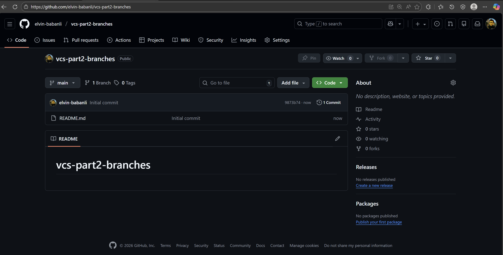 |
| 2 | Create a folder structure with subfolders and files | 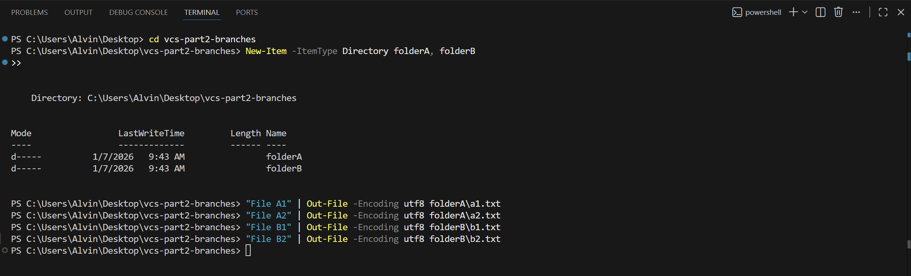 |
| 3 | Create a repository in the main folder | 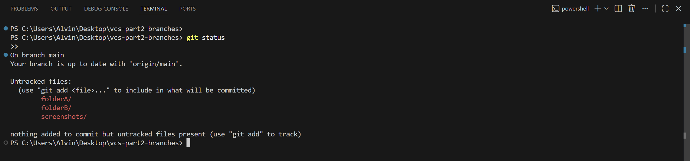 |
| 4 | Stage all files using `git add` | 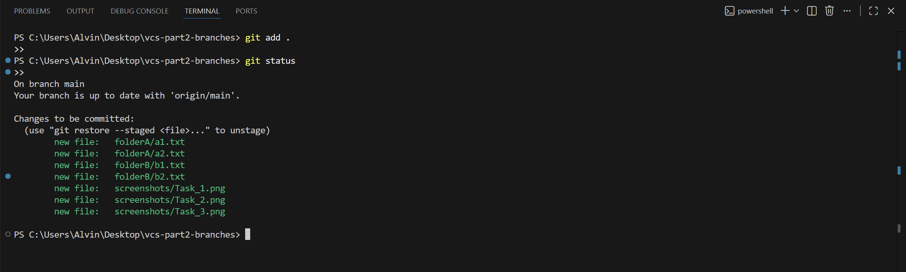 |
| 5 | Create a commit using `git commit` | 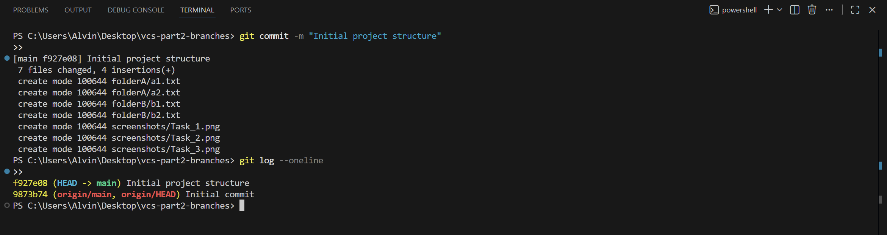 |
| 6 | Create a new branch named `newbranch` | 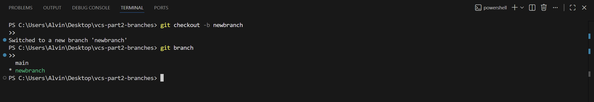 |
| 7 | In `newbranch`, add a new folder + files and commit | 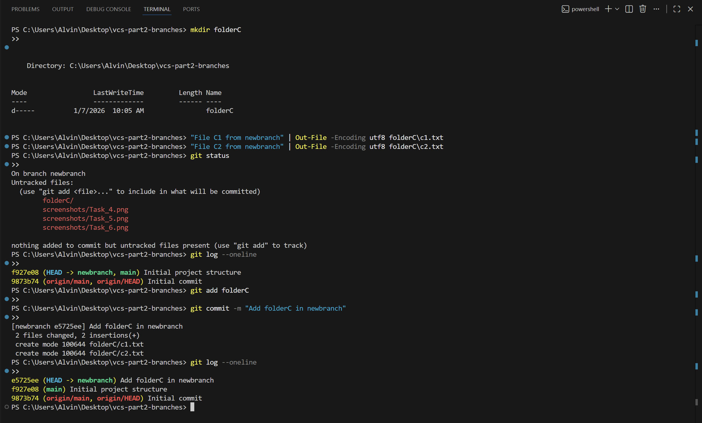 |
| 8 | In `main` (master), add a new folder + files and commit | 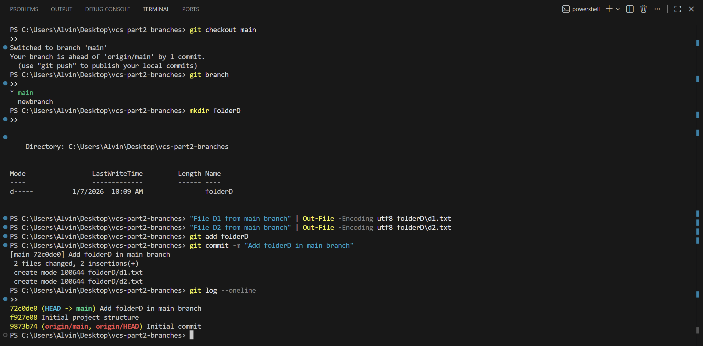 |
| 9 | In `newbranch`, merge `main` into `newbranch` | 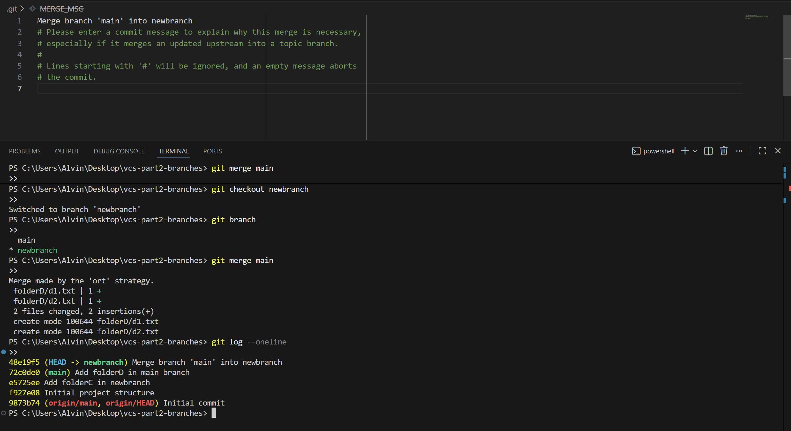 |
| 10 | In `main`, modify existing files to create merge conflicts and commit | 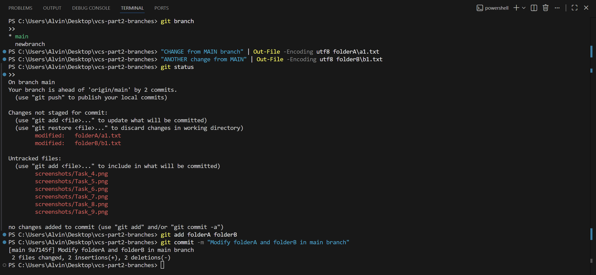 |
| 11 | In `newbranch`, merge `main` into `newbranch` and resolve conflicts | 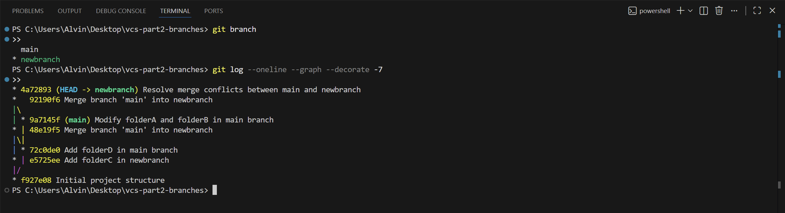 |

---

## 🧠 Key Git Commands Used

- `git add .`
- `git commit -m "..."`
- `git checkout -b newbranch`
- `git merge main`
- conflict resolution + merge commit

